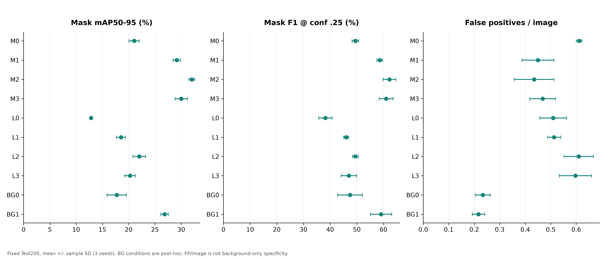

# Camouflage Segmentation with Synthetic Data

2026 소프트웨어 졸업작품 · 실제 데이터 부족 환경에서 합성 데이터의 효과를 검증하는 위장 객체 instance segmentation 연구·자동화 시스템.

**현재 학기 학습 40회, 고유 모델 34개 Test 평가, 합성 이미지 33,000장 생성까지 완료했습니다.** 이 저장소는 코드와 집계 결과를 공개합니다. 원본/합성 이미지, 개별 이미지 라벨·마스크, 학습 checkpoint, 가상환경과 개인정보는 포함하지 않습니다.

[실험 설명표](docs/EXPERIMENT_LOOKUP_KO.md) · [결과와 한계](docs/RESULTS_AND_LIMITATIONS.md) · [재현 범위·실행 안내](docs/REPRODUCIBILITY.md) · [완성도 평가](docs/COMPLETENESS_REVIEW.md) · [제3자 라이선스](THIRD_PARTY_NOTICES.md)

## 무엇을 만들었나?

- 실제 객체·배경을 조합하는 휴리스틱 합성기와 Tone/Texture/Edge/Placement 선택 점수 ablation.
- AnyDoor 기반 합성 후보 생성 및 동일 후보 pool의 random/task-aware 선택 비교.
- custom **DualHeadSegment H2 n-scale** 학습·평가. 별도 H0/H1 실험으로 boundary 보조 학습을 분해.
- 자원 제한, 의존성, 실패 격리, checkpoint 재개, Windows SSH 세션 분리, provenance/hash 검증을 포함하는 실행기.
- 전체/25% 실제 데이터 실험, background-only 2×2 보완 실험, 학습 곡선·실험 표·한계 분석.
- 오프라인 예측 비교 UI와 새 이미지 GPU 추론 서버 코드. 공개 저장소에는 재생용 Test 이미지와 가중치를 넣지 않았습니다.

## 핵심 결과

현재 학기의 같은 **실제 Test 200장**에서 평가한 **Mask mAP50–95 ×100, 평균 ± 3 training seeds의 표본 SD**입니다. 이미지 정답률이 아니며 SD는 신뢰구간이 아닙니다.

| 학습 조건 | 실제 748장 · M | 실제 187장(25%) · L |
| --- | ---: | ---: |
| 실제 데이터만 | 21.03 ± 0.98 | 12.85 ± 0.16 |
| + 휴리스틱 3,000장 | 29.14 ± 0.68 | 18.54 ± 0.86 |
| + AnyDoor random 3,000장 | **31.99 ± 0.55** | **22.01 ± 1.18** |
| + AnyDoor task-aware 3,000장 | 29.98 ± 1.18 | 20.26 ± 1.02 |



합성 추가 개선은 관찰됐지만 task-aware의 우위는 확인되지 않았습니다. Background-only 2,129장을 추가하면 오탐은 줄었으나 Recall/mAP도 감소했습니다. Full 휴리스틱과 거리 가중 boundary loss가 모든 조건에서 가장 좋았던 것도 아닙니다. 긍정·부정 결과를 함께 공개합니다.

## 실험 지도

| ID | 비교하는 내용 | 반복 / 학습량 | 평가 |
| --- | --- | --- | --- |
| M0~M3 | 실제748 + 없음/휴리스틱/AnyDoor random/task-aware | seeds0·1·2 / 150epochs | Val-best → Test200 |
| L0~L3 | 고정 실제187 + 같은 네 전략 | seeds0·1·2 / 150epochs | Val-best → Test200 |
| A0~A5 | 휴리스틱 선택 점수 제거 | seed0 / 40epochs | Val100만 |
| H0/H1/H2 × R/S | boundary 없음/일반BCE/거리 가중BCE | seed0 / 150epochs | Test200 |
| BG0/BG1 | 실제-only/휴리스틱 혼합에 배경2129 추가 | seeds0·1·2 / 150epochs | 기존 Test 재사용, 사후 보완 |

H2_R/H2_S는 M0_seed0/M1_seed0를 재사용해 추가 학습하지 않았습니다. A5는 AnyDoor가 아니라 **Placement 선택 점수 제외**입니다. 1학기 S4/S3 및 hard-mining 결과는 역사적 맥락으로 별도 보관하며 학기간 완전한 통제 비교로 주장하지 않습니다.

## 먼저 실행해 보기: GPU·데이터 없이

Python 3.11에서 표준 라이브러리만으로 집계 수치와 핵심 fixture 테스트를 확인할 수 있습니다.

```bash
git clone --branch release/capstone-final-20260927 https://github.com/gaenari0911/Capstone-Project-Camouflage-Net-Detection.git
cd Capstone-Project-Camouflage-Net-Detection
python tools/verify_public_results.py
python -m unittest tests.test_s0_s1 tests.test_s3_synthesis -v
python tools/test_s8_anydoor_selection.py -v
```

첫 명령은 공개 CSV의 40개 학습/5,340 epoch/34개 Test와 평균·표준편차를 다시 계산하고, 공개 원본 복사본의 SHA-256을 확인합니다. 나머지는 실제 학습 대신 임시 fixture로 스케줄러·합성 선택 로직을 검사합니다. 이 검증을 전체 GPU 학습 재현으로 표현하지 않습니다.

GPU 학습은 **일반 PyPI Ultralytics로 대체할 수 없는 custom fork**, 데이터, pretrained와 campaign 입력이 필요합니다. [재현 안내](docs/REPRODUCIBILITY.md)를 먼저 읽으세요. 원래 서버의 가상환경이나 디스크 경로가 clone에 자동 포함되는 것은 아닙니다.

## 저장소 구조

```text
capstone_lab/       # 합성, 학습, 검증, scheduler/supervisor
tools/             # AnyDoor adapter, 후속 실험, 보고서, 데모, 공개 결과 검증
tests/             # fixture/회귀 및 기존 환경 전용 테스트
configs/           # 역사적 동결 설정·승인·환경 기록 (새 실행 설정과 구분)
models/            # custom DualHeadSegment YAML
third_party/       # 실제 사용한 custom Ultralytics 소스와 원본 AGPL 라이선스
results/tables/    # 조건·seed·epoch 단위 집계 CSV
results/figures/   # 원본 사진 없는 수치 그래프 7종
results/evidence/  # 기존 완료 감사 기록 (당시 서버 환경 기준)
docs/              # 설정 사전, 결과 해석, 재현 범위, 한계
```

## 한계와 공개 범위

같은 epoch라도 이미지 수가 달라 optimizer update 수는 동일하지 않습니다. A/H는 단일 seed이고, Test는200장입니다. BG는 기존 Test 결과를 본 뒤 진행한 사후 실험입니다. 장면 단위 독립성과 합성 mask의 정확성을 별도 독립 주석으로 완전히 검증하지 않았습니다. 1학기와 현재의 학습 recipe·membership 차이가 남아 단순한 학기간 순위 비교를 피합니다.

현재 결과는 **졸업작품·연구 프로토타입**이며 현장 배포 정확도, 안전성, 모든 장애로부터의 자동 복구를 보장하지 않습니다. 원본 데이터와 full demo는 재배포 권한 확인 전 공개하지 않습니다. 설치 의존성·제3자 코드/모델의 라이선스는 [별도 고지](THIRD_PARTY_NOTICES.md)를 따릅니다.
