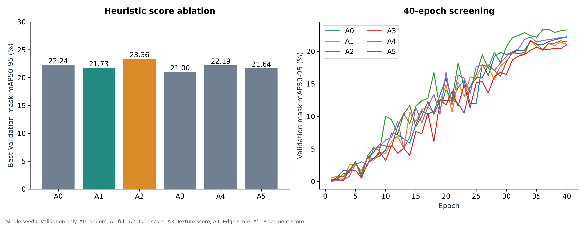
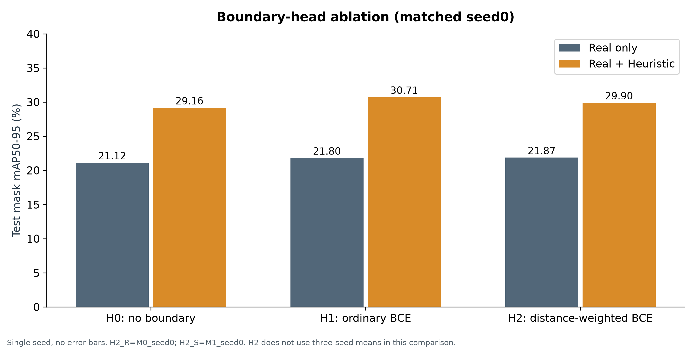
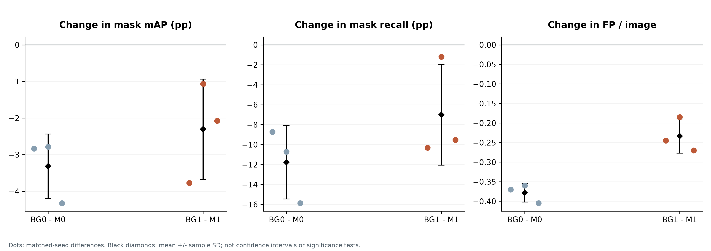
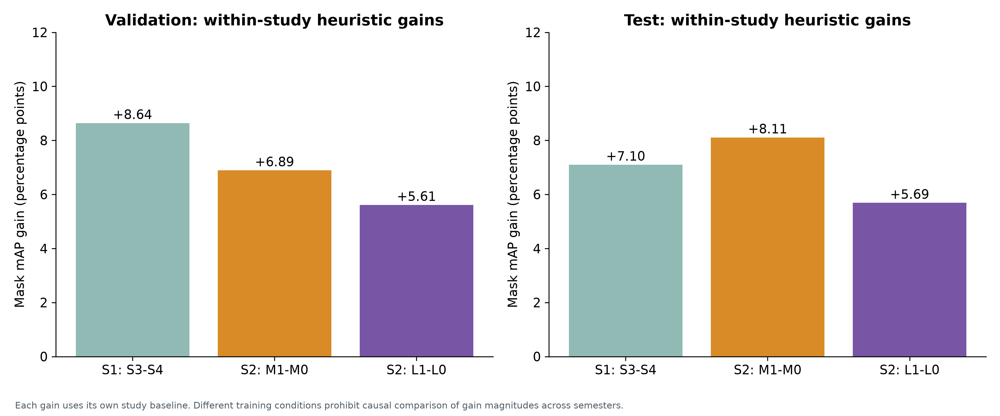

# 결과 요약과 연구 한계

## 검증 범위

현재 학기 학습40개, 총5,340 epoch 기록, Validation40개와 Test34개의74개 checkpoint/split 행이다. A0~A5는40epoch/seed0/Val-only이다. 나머지는150epochs이며 M/L/BG는3seeds, H0/H1은seed0다. H2 참조는 M0/M1 seed0와 동일 checkpoint라 중복 학습으로 세지 않는다.

수치 원본은 [all_checkpoint_metrics.csv](../results/tables/all_checkpoint_metrics.csv), 평균·SD는 [all_summary_mean_sd.csv](../results/tables/all_summary_mean_sd.csv), 학습곡선 원자료는 [all_epoch_metrics.csv](../results/tables/all_epoch_metrics.csv)다. 공개용 export는 수치를 수정하지 않았다.

## 1. 합성 데이터는 유효했는가?

현재 학기 Test mask mAP50–95(100배 척도) 기준으로 M1−M0는 +8.11pp, M2−M0는 +10.96pp다. 실제187장의 L 조건에서도 L1−L0 +5.69pp, L2−L0 +9.17pp로 개선됐다. 실제 부족 환경에서 합성의 보완 가능성을 보여준다.

L2의22.01이 M0의21.03보다 높지만 실제 라벨75%를 대체했다는 증명은 아니다. 외부 배경/생성 모델/pretrained를 사용했고 데이터량·optimizer update도 함께 달라졌다.

## 2. 복잡한 선택 전략이 항상 좋았는가?

아니다. 동일 AnyDoor 후보 pool에서 task-aware−random은 M −2.01pp, L −1.76pp다. Judge의 난도가 학습 효용과 같지 않고 label noise와 섞일 가능성이 있으나 그 원인을 인과적으로 증명한 것은 아니다.

A0~A5 Validation mAP은22.24/21.73/23.36/21.00/22.19/21.64다. A2가 가장 높고 Full A1은 무작위A0보다 낮다. 모든 점수의 필수성을 지지하지 않는다. A는40epochs/단일seed이므로 작은 차이를 확정적인 기여도로 해석하지 않는다. 점수 제거는 rendering 제거가 아니다.

## 3. DualHead 구조는 도움이 됐는가?

같은 seed0 Test에서 실제-only H0/H1/H2는21.12/21.80/21.87, 실제+휴리스틱은29.16/30.71/29.90이다. Boundary 보조 학습의 관찰상 이점은 있지만 거리 가중 방식의 추가 이점은 일관되지 않는다. 단일seed이며 parameter/학습 비용 차이와 분리된 보편적 구조 우위를 주장하지 않는다.

## 4. 배경-only 추가는 도움이 됐는가?

M0↔BG0, M1↔BG1은 같은 배경2129장을 추가하는 비교다. BG0↔BG1만 보면 합성 추가 효과다. BG 비율은74.00%/36.23%로 다르다.

| 비교 | Mask mAP 변화 | Precision 변화 | Recall 변화 | FP/image |
| --- | ---: | ---: | ---: | --- |
| BG0−M0 | −3.31pp | +16.50pp | −11.77pp | 0.612→0.233 |
| BG1−M1 | −2.30pp | +12.78pp | −7.01pp | 0.450→0.217 |

오탐은 줄었으나 놓침은 증가하고 mAP는 낮아졌다. 현재 설정의 trade-off이며 배경을 넣으면 항상 좋아진다/항상 나쁘다는 결론이 아니다. FP/image는 객체가 있는 기존 Test에서의 오탐으로, 새 background-only holdout의 specificity/FPR이 아니다. BG 결과는 기존 Test를 재사용한 사후 보완이다.

## 5. 1학기와 연결되는 결론

보관 Test mask mAP은 S4(real+BG)27.76, S3(real+합성+BG)34.86으로 +7.10pp다. Hard mining 후는27.47/33.54로 strict mask mAP의 추가 개선을 보이지 않았다. 해당 수치는 보관 CSV이지 이번에 재추론한 결과가 아니다.

현재 M0는 background 없는 실제-only이므로 과거S4와 같지 않다. 합성 장수, 과거 실제 membership, augmentation/scheduler/early stopping, 평가 경로의 차이도 남는다. 두 학기 내부에서 합성의 개선을 확인했다는 맥락으로 설명하고, 현재 모델이 1학기보다 우수/열등하다는 통제 비교로 쓰지 않는다. 과거 P/R/F1은Box, 현재는 fixed-threshold Mask다.

## 6. 공개적으로 명시하는 한계

- Test200, A/H 단일seed, M/L/BG3seeds이며 표본SD를 신뢰구간이나 유의성 검정으로 바꾸지 않는다.
- 같은150epochs여도 M0/M1/L0/L1/BG0/BG1 update는7,050/35,250/1,800/30,000/27,000/55,200으로 다르다.
- exact hash 중복 검사만으로 장면·연속 촬영의 근접 중복과 정보 누수 부재를 증명하지 않는다.
- AnyDoor 합성 mask는 근사 라벨이며 독립 주석의 완벽한 GT로 간주하지 않는다.
- 큰 차이 예측 사례는 사후 설명용 선택이다. 그림의 Union IoU는 공식 instance mAP나 seed 분산이 아니다.
- BG는 사후 실험이고, 과거1학기는 완전한 동일 recipe 재현이 아니다.
- 현재 환경의 완료 기록은 새 컴퓨터의 전체 end-to-end 실행 보장이나 현장 배포 검증이 아니다.

졸업작품의 주장 범위는 “고정된 평가 조건에서 합성 전략의 효용과 한계를 실험적으로 분석하고 이를 자동화했다”이다. SOTA, 모든 환경에서의 우위, 완벽한 mask, 검증되지 않은 실시간 서비스 성능을 주장하지 않는다.
